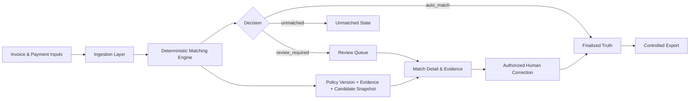

# InvoMatch

### Deterministic Invoice Reconciliation & Evidence Platform

InvoMatch is a production-oriented financial reconciliation platform designed to match invoices and payments through **deterministic, explainable business rules** rather than opaque scoring alone.

This public repository is a **portfolio representation** of the project. The production source code and operational configuration remain private.

---

## Why InvoMatch?

Financial reconciliation becomes difficult when real-world data contains:

- small amount differences,
- payment/invoice date gaps,
- missing or conflicting references,
- partial payments,
- duplicate invoice candidates,
- currency mismatches,
- and cases where automation should stop and require human review.

InvoMatch is designed around a simple principle:

> A financial decision should be reproducible, explainable, reviewable, and traceable to the evidence that produced it.

---

## Core Capabilities

### Deterministic Matching Engine
A single authoritative decision engine applies versioned reconciliation policy and produces canonical outcomes:

- `auto_match`
- `review_required`
- `unmatched`

Policy behavior is deterministic so the same evidence and policy version produce the same decision.

### Explainable Evidence
Matching decisions preserve structured evidence and policy provenance so operators can understand **why** a decision was produced.

Examples include:

- amount comparison,
- date tolerance,
- reference agreement or conflict,
- currency consistency,
- duplicate-candidate context,
- partial-payment conditions.

### Human Review Workflow
Cases that should not be finalized automatically are routed into a durable review workflow.

Review actions are backend-authorized, persisted, and separated from original machine evidence so automated evidence remains auditable after a human correction.

### Candidate & Ambiguity Handling
The platform supports deterministic candidate representation when more than one invoice may correspond to a payment.

Ambiguous cases are not silently converted into automatic matches.

### Tenant Isolation
Authenticated tenant context is propagated through ingestion and run ownership boundaries. Cross-tenant access is explicitly denied at data and export boundaries.

### Durable Operations
The production-oriented runtime includes durable application state, controlled restart behavior, backup/restore validation, and containerized deployment workflows.

---

## Architecture

The system follows layered boundaries between API, services, domain logic, and persistence. Matching authority remains backend-owned; the UI presents persisted decisions rather than recomputing financial truth.

See [Architecture Overview](docs/ARCHITECTURE.md).

---

## Production Engineering Principles

InvoMatch was developed as a production system rather than a demo application.

Key engineering principles include:

- one authoritative matching decision path,
- versioned reconciliation policy,
- deterministic decision precedence,
- persisted evidence and provenance,
- backward-compatible persistence evolution,
- tenant-aware authorization,
- durable review state,
- controlled finalization,
- restart and recovery validation,
- CI-based release validation,
- strict separation between machine evidence and human correction.

---

## Matching Policy Examples

The production policy covers several common reconciliation conditions:

| Condition | System behavior |
|---|---|
| Exact / accepted amount agreement | May qualify for automatic match |
| Small amount variance | Can require review depending on policy threshold |
| Date variance | Evaluated against deterministic tolerance rules |
| Conflicting reference | Automatic match prohibited |
| Partial payment | Explicitly identified and gated |
| Duplicate invoice candidates | Candidate ambiguity preserved |
| Currency mismatch | Treated as a financial matching blocker |

The exact production implementation remains private.

---

## Reliability & Validation

The project has been developed through staged architecture, policy-hardening, UI-hardening, workflow-correction, and production-system-validation work.

Recent validation milestones in the private production repository include:

- **800+ backend tests** in the hardened production workflow,
- focused matching-policy and integration suites,
- frontend behavior tests,
- TypeScript production builds,
- ESLint,
- Ruff,
- strict MyPy on changed production modules,
- Python compilation checks,
- container/runtime smoke validation,
- restart persistence checks,
- backup/restore validation,
- tenant-isolation regression coverage.

The purpose of these checks is not test-count maximization; it is protection of financial decision integrity across changes.

---

## Technology

The private production implementation uses a modern web/service stack including:

- **Python**
- **FastAPI**
- **React**
- **TypeScript**
- **SQLite-backed durable persistence**
- **Docker / Docker Compose**
- **GitHub Actions**
- **Nginx / reverse-proxy deployment boundary**
- static analysis and automated test gates

---

## My Role

I designed and developed InvoMatch as an end-to-end product and engineering project, including:

- product and workflow design,
- system architecture,
- reconciliation policy design,
- backend service boundaries,
- evidence and provenance model,
- human-review workflow,
- tenant-isolation requirements,
- production UI behavior,
- testing and validation strategy,
- deployment and operational readiness,
- release/governance boundaries.

The project was developed iteratively with explicit architecture gates and production-readiness validation rather than treating the matching engine as an isolated script.

---

## What This Repository Contains

This repository intentionally contains portfolio-safe material only:

- product overview,
- architecture overview,
- engineering decisions,
- selected workflow descriptions,
- technology and validation summary.

It does **not** contain:

- production source code,
- credentials or environment files,
- production infrastructure details,
- private customer data,
- proprietary policy implementation internals,
- deployment secrets.

---

## Project Status

**Production-oriented system under active development and validation.**

The private codebase has progressed through controlled-pilot readiness, matching architecture hardening, policy hardening, production UI hardening, review-workflow correction, and production-system validation.

---

## Recruiter / Engineering Review

If you are reviewing this project as part of a hiring process, the most relevant sections are:

1. [Architecture Overview](docs/ARCHITECTURE.md)
2. [Engineering Highlights](docs/ENGINEERING_HIGHLIGHTS.md)
3. **My Role** above
4. **Reliability & Validation** above

Private implementation details can be discussed at an appropriate level during an interview.

---

## Author

**Alireza Habibian**  
GitHub: [@ahabibian](https://github.com/ahabibian)

---

> Portfolio note: InvoMatch's production repository is intentionally private. This repository documents the engineering approach without publishing proprietary implementation or sensitive operational material.
