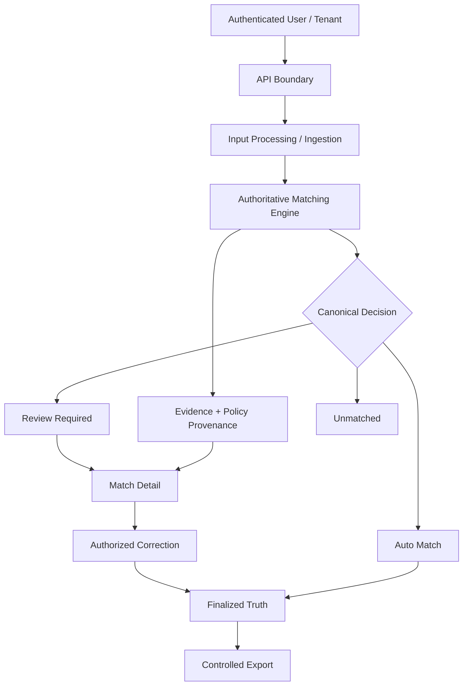

# InvoMatch Architecture Overview

## Objective

InvoMatch is designed to turn invoice/payment reconciliation into a reproducible financial decision process.

The architecture is built around five requirements:

1. deterministic decisions,
2. explicit evidence,
3. safe human review,
4. tenant isolation,
5. durable operational behavior.

## Logical Flow

## Decision Authority

The frontend does not independently calculate reconciliation truth.

The backend owns:

- canonical status,
- policy version,
- structured evidence,
- candidate set,
- review authorization,
- finalization eligibility.

This reduces disagreement between UI presentation and persisted financial state.

## Deterministic Policy Layer

The matching engine evaluates financial evidence through versioned rules and explicit precedence.

Examples of policy dimensions include:

- amount tolerance,
- date tolerance,
- reference mismatch,
- partial payment,
- duplicate candidates,
- currency mismatch.

The design intentionally distinguishes positive evidence, review conditions, and blockers.

## Evidence & Provenance

A decision is not stored only as a status.

The system also preserves context needed to explain that status, including structured evidence, candidate snapshots, and the policy version responsible for the decision.

This supports:

- operator review,
- debugging,
- regression analysis,
- future auditability,
- safer policy evolution.

## Review Workflow

`review_required` is treated as a real persisted business state rather than a temporary UI condition.

Human actions are authorized by backend rules. Corrections are persisted while original machine evidence remains available, preventing a human edit from erasing how the automated decision was originally reached.

## Tenant Boundary

Tenant identity is derived from authenticated context and propagated through ingestion-created runs.

The architecture explicitly tests cross-tenant denial behavior. Export retrieval is also tenant-scoped, including cached artifact paths.

## Persistence & Compatibility

Persistence changes are designed to remain compatible with historical rows while allowing newer decisions to store richer evidence and policy metadata.

## Operational Reliability

The controlled runtime includes:

- containerized services,
- durable state,
- restart validation,
- backup and restore procedures,
- CI runtime smoke tests,
- release-validation gates.

## Public Portfolio Boundary

This document describes architecture at a portfolio-safe level. It intentionally excludes source code, secrets, private infrastructure identifiers, and proprietary implementation details.
